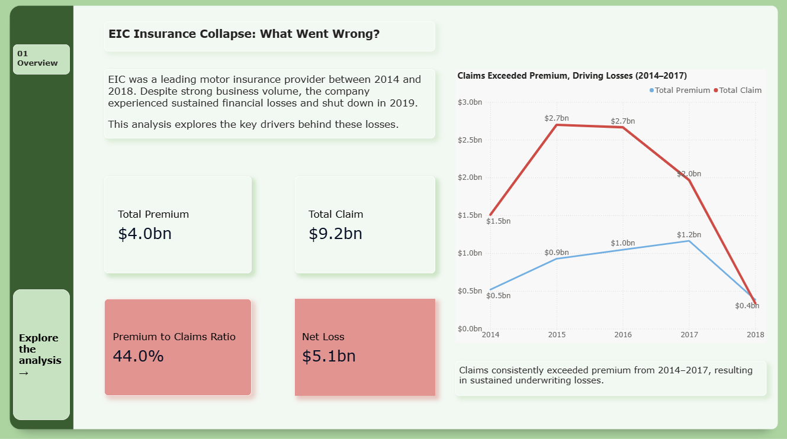
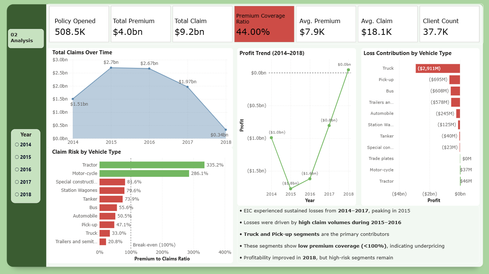

# EIC Insurance Collapse: What Went Wrong?

## Project Overview

EIC was a motor insurance company operating between 2014 and 2018.  
Even though the company had strong business volume, it consistently made losses and eventually shut down in 2019.

In this project, I used Power BI to understand what went wrong by analyzing claims, premium, and risk patterns.

---

## What I Wanted to Find

I tried to answer a few key questions:

- When did the losses start and peak?
- What was causing those losses?
- Which segments were responsible?
- Why wasn’t the company profitable?

---

## Dashboard Preview

### Overview Page

### Analysis Dashboard

---

## Key Takeaways

- The company was making losses almost every year from 2014 to 2017  
- Claims were consistently higher than premium, which caused the losses  
- Truck and Pick-up categories were the biggest contributors  
- Many segments had poor premium coverage (below 100%), which suggests underpricing  
- There was some recovery in 2018, but the overall damage was already significant  

---

## Tools Used

- Power BI  
- DAX  
- Basic data modeling  

---

## Files in this Repo

- `EIC_Insurance-analysis.pbix` -> Power BI file  
- `images/` -> Screenshots of the dashboard  

---

## How to View

Download the `.pbix` file and open it in Power BI Desktop to explore the dashboard.

---

## About Me

Athul
